# Keybindings — Current State (`master` @ `d7ecfac5`)

> Component & data-flow map of Warp's keybindings subsystem **as it exists on `origin/master`** —
> read from a pinned detached worktree so unmerged spike code on `sha-ir/keybindings-draft`
> (`keymap/overlap.rs`, layered resolution, the torn-read example) cannot leak into the baseline.

**Produced by:** the `keybindings-current-state-chart` workflow (23 agents). Seven senior-architect
readers each extracted one subsystem slice from the master snapshot; **two independent adversarial
red-teamers re-verified every node, edge, and claim against master code**; a lead architect
synthesized the slices into one flowchart (confirmed-by-both elements only); a mermaid validator
passed it clean. Corrections the red-teamers forced are listed at the bottom.

## How a keystroke resolves today

Today a physical keystroke enters AppContext::dispatch_keystroke, which walks the responder chain innermost-first and hands one Keystroke at a time to Matcher::push_keystroke; that function appends to a per-view pending buffer and does a linear, no-scoring first-match scan over Keymap::bindings(), which yields editable bindings in reverse-registration (LIFO) order then fixed bindings reversed, returning the first whose Trigger::Keystrokes prefix-matches and whose ContextPredicate.eval(ctx) is true. Bindings themselves are code, not data: ~265 imperative register_* call sites append (no dedup) into two parallel Vecs, and user customizations reach the live keymap only at startup, when launch() calls load_custom_keybindings once to read keybindings.yaml and push each entry through set_custom_trigger into update_custom_trigger. The papercuts are the story: the config file is loaded launch-only (the FS watcher has no keybindings branch, so edits need a restart); overrides are applied by name only and are context-blind; Trigger::Empty is a pseudo-unbind the matcher silently never fires; precedence is purely linear first-match/LIFO (and inconsistent with the FIFO get_binding_by_name lookup); the settings editor captures only a single keystroke (overwriting on each keydown) despite the format and engine supporting chords; search ranks by description rather than action name; and modality is gated by a single vim_mode boolean with no mode enum (no helix/kakoune), feeding a parallel pure VimFSA that bypasses the keymap matcher for editing keys.

## Diagram

```mermaid
flowchart TB
  subgraph CFG["Config and File"]
    yaml["keybindings.yaml — user config file<br/><small>app/src/keyboard.rs</small>"]
    custom_kb["CustomKeybindings — flat map name to PersistedTrigger / type<br/><small>app/src/keyboard.rs</small>"]
    load_fn["load_custom_keybindings — launch-only loader / logic<br/><small>app/src/keyboard.rs</small>"]
    launch["launch — startup entry / logic<br/><small>app/src/lib.rs</small>"]
    write_fn["write_custom_keybinding — persist to disk / logic<br/><small>app/src/keyboard.rs</small>"]
    watcher["WarpConfig FS watcher — no keybindings reload branch / logic<br/><small>app/src/user_config/native.rs</small>"]
  end
  subgraph ENG["Engine warpui_core keymap"]
    keymap["Keymap — fixed plus editable stores, name index, custom caches / store<br/><small>keymap.rs</small>"]
    fixed_vec["fixed_bindings — immutable, non-overridable / store<br/><small>keymap.rs</small>"]
    editable_vec["editable_bindings — Tracked, user-overridable / store<br/><small>keymap.rs</small>"]
    trigger["Trigger enum: Keystrokes / Standard / Custom / Empty / type<br/><small>keymap.rs</small>"]
    keystroke["Keystroke — single chord, mods plus one key / type<br/><small>keymap.rs</small>"]
    ctx_pred["Context plus ContextPredicate AST — Rust-only, no parser / type<br/><small>keymap/context.rs</small>"]
    as_lens["EditableBinding::as_lens — override resolve / logic<br/><small>keymap.rs</small>"]
    update_custom["Keymap::update_custom_trigger — name-only override / logic<br/><small>keymap.rs</small>"]
    bindings_iter["Keymap::bindings — editable LIFO then fixed reversed / logic<br/><small>keymap.rs</small>"]
    matcher["Matcher — keymap plus per-view pending buffer / store<br/><small>keymap/matcher.rs</small>"]
    push_ks["Matcher::push_keystroke — linear first-match scan / logic<br/><small>keymap/matcher.rs</small>"]
    set_keymap["Matcher::set_keymap — wholesale reload / logic<br/><small>keymap/matcher.rs</small>"]
    dispatch["AppContext::dispatch_keystroke — responder chain, one keystroke / logic<br/><small>core/app.rs</small>"]
    app_set["AppContext::set_custom_trigger and remove / logic<br/><small>core/app.rs</small>"]
  end
  subgraph REG["Registration"]
    call_sites["approx 265 register_* call sites across 109 files / logic<br/><small>app/src/root_view.rs</small>"]
    app_register["AppContext::register_fixed and editable_bindings / logic<br/><small>core/app.rs</small>"]
    matcher_register["Matcher::register_* — append-only, Custom to Keystroke rewrite / logic<br/><small>keymap/matcher.rs</small>"]
    fixed_type["FixedBinding — no name, non-overridable / type<br/><small>keymap.rs</small>"]
    editable_type["EditableBinding — name, default Empty, custom_trigger / type<br/><small>keymap.rs</small>"]
  end
  subgraph UI["Settings UI"]
    editor["KeybindingsView editor — one row at a time / ui<br/><small>settings_view/keybindings.rs</small>"]
    modifying["KeyBindingModifyingState — single optional Keystroke / store<br/><small>settings_view/keybindings.rs</small>"]
    conflict["ConflictMap — keyed on bare Keystroke, context-blind / store<br/><small>settings_view/keybindings.rs</small>"]
    set_custom_kb["set_custom_keybinding — one-key writeback, no conflict gate / logic<br/><small>util/bindings.rs</small>"]
    search["filter_bindings_including_keystroke — search by description / logic<br/><small>util/bindings.rs</small>"]
    notifier["KeybindingChangedNotifier — live in-session update / store<br/><small>settings_view/keybindings.rs</small>"]
    cheatsheet["Cheatsheet KeybindingsView — read-only / ui<br/><small>resource_center/keybindings_page.rs</small>"]
  end
  subgraph VIM["Modal vim"]
    vim_gate["vim_mode bool gate — no mode enum, no helix or kakoune / config<br/><small>settings/editor.rs</small>"]
    editor_view["CodeEditorView — vim driver / ui<br/><small>code/editor/view.rs</small>"]
    vim_fsa["VimFSA — pure single-keystroke state machine / modal<br/><small>crates/vim/src/vim.rs</small>"]
    vim_event["VimEvent and VimEventType / type<br/><small>crates/vim/src/vim.rs</small>"]
    vim_handler["impl VimHandler for CodeEditorView — exhaustive match / modal<br/><small>code/editor/view/vim_handler.rs</small>"]
    vim_algos["pure motion algos — word, find-char, bracket, text-object / modal<br/><small>crates/vim</small>"]
  end

  launch -->|calls once at launch, restart needed| load_fn
  load_fn -->|reads file one-shot| yaml
  yaml -->|serde_yaml deserialize| custom_kb
  load_fn -->|per entry calls set_custom_trigger, Removed to Empty| app_set
  write_fn -->|serde_yaml to_writer| yaml
  watcher -.->|keybindings.yaml never reloaded| yaml

  app_set -->|delegates name-only override| update_custom
  update_custom -->|writes custom_trigger where name matches| editable_vec
  keymap -->|owns| fixed_vec
  keymap -->|owns| editable_vec
  matcher -->|owns| keymap
  bindings_iter -->|reads editable reverse LIFO via as_lens| editable_vec
  bindings_iter -->|reads fixed reversed| fixed_vec
  editable_vec -->|each resolved through| as_lens
  as_lens -->|custom_trigger becomes active, default to original| trigger
  trigger -->|Keystrokes holds vec of| keystroke
  push_ks -->|first-match scan over| bindings_iter
  push_ks -->|matches Keystrokes only, Empty unmatched| trigger
  push_ks -->|gates each binding| ctx_pred
  set_keymap -->|wholesale replace| keymap
  dispatch -->|feeds one keystroke per call, innermost first| push_ks

  call_sites -->|build and pass binding items| app_register
  app_register -->|forwards to keystroke_matcher| matcher_register
  matcher_register -->|appends, no dedup or conflict check| keymap
  editable_type -->|stored in| editable_vec
  fixed_type -->|stored in| fixed_vec
  editable_type -->|default trigger Empty until builder sets key| trigger

  editor -->|materializes editable lenses| editable_vec
  editor -->|capture overwrites each keydown, single key| modifying
  editor -->|seeds and updates| conflict
  conflict -.->|warn border plus generic text, non-blocking| editor
  editor -->|Save with no conflict gate| set_custom_kb
  set_custom_kb -->|live one-key apply| app_set
  set_custom_kb -->|persist name to keystroke| write_fn
  set_custom_kb -->|emits change| notifier
  editor -->|filters rows| search
  cheatsheet -->|search via shared filter| search
  search -->|fuzzy on description, action name ignored| editable_type
  notifier -->|subscription, live patch| cheatsheet
  cheatsheet -.->|here link jumps to editor| editor

  vim_gate -->|gates input, read live| editor_view
  editor_view -->|feeds keystrokes, single keystroke| vim_fsa
  vim_fsa -->|emits at most one per key| vim_event
  vim_event -->|exhaustive linear match| vim_handler
  vim_handler -->|realizes motions via| vim_algos

  classDef store fill:#e3f2fd,stroke:#1565c0,color:#0d1b2a;
  classDef type fill:#f3e5f5,stroke:#6a1b9a,color:#0d1b2a;
  classDef logic fill:#e8f5e9,stroke:#2e7d32,color:#0d1b2a;
  classDef ui fill:#fff3e0,stroke:#ef6c00,color:#0d1b2a;
  classDef modal fill:#fce4ec,stroke:#c2185b,color:#0d1b2a;
  classDef config fill:#eceff1,stroke:#455a64,color:#0d1b2a;

  class keymap,fixed_vec,editable_vec,matcher,modifying,conflict,notifier store;
  class custom_kb,trigger,keystroke,ctx_pred,fixed_type,editable_type,vim_event type;
  class load_fn,launch,write_fn,watcher,as_lens,update_custom,bindings_iter,push_ks,set_keymap,dispatch,app_set,call_sites,app_register,matcher_register,set_custom_kb,search logic;
  class editor,cheatsheet,editor_view ui;
  class vim_fsa,vim_handler,vim_algos modal;
  class yaml,vim_gate config;
```

## Legend

Node classes (by fill): store = mutable in-memory state holders (the two binding Vecs, the Keymap/Matcher, the editor's modifying/conflict state, the change notifier); type = data shapes and enums (Trigger, Keystroke, Context/ContextPredicate, the binding types, CustomKeybindings, VimEvent); logic = functions and call paths (loaders, registration, override, the scan, dispatch, settings write/search); ui = user-facing views (settings editor, read-only cheatsheet, code editor vim driver); modal = the parallel pure-vim subsystem (FSA, handler, motion algorithms); config = the on-disk file and the vim_mode boolean.

Edge meanings: "loads/reads/persist" = config-file I/O; "delegates name-only override" + "writes custom_trigger where name matches" = the context-blind rebind path (update_custom_trigger filters only by binding.name, hitting every same-named editable binding regardless of ContextPredicate); "reads editable reverse LIFO / reads fixed reversed" = bindings() precedence (most-recently-registered editable wins, then fixed, both reversed); "first-match scan over" = push_keystroke's linear, no-scoring resolution; "matches Keystrokes only, Empty unmatched" = Trigger::Empty is the pseudo-unbind sentinel the matcher never fires; "gates each binding" = the sole context gate (ContextPredicate::eval); "feeds one keystroke per call" = dispatch_keystroke walks the responder chain innermost-first, one Keystroke at a time; "append-only, no dedup" = registration semantics; "capture overwrites each keydown, single key" + "one-key writeback" = the settings UI can only ever record a single chord even though the file format and engine support multi-key sequences; "fuzzy on description, action name ignored" = search ranks by description text, not the action identifier. Dotted edges are negative/weak relations: the FS watcher receives events but has no keybindings branch (never reloaded), the conflict warning is advisory and non-blocking, and the cheatsheet only links out to the editor.

## Key code anchors

| Component | Source (on `master`) |
|---|---|
| keybindings.yaml (CustomKeybindings) | `app/src/keyboard.rs:33,95-97,167-187` |
| load_custom_keybindings (launch-only loader) | `app/src/keyboard.rs:37-57` |
| launch calls load_custom_keybindings once | `app/src/lib.rs:2551-2561` |
| write_custom_keybinding (persist) | `app/src/keyboard.rs:64-75` |
| WarpConfig FS watcher has no keybindings reload branch | `app/src/user_config/native.rs:74-134` |
| Keymap store (two Vecs, name index, custom caches) | `crates/warpui_core/src/keymap.rs:24-38` |
| fixed_bindings store | `crates/warpui_core/src/keymap.rs:26` |
| editable_bindings store | `crates/warpui_core/src/keymap.rs:27` |
| Trigger enum (Keystrokes/Standard/Custom/Empty) | `crates/warpui_core/src/keymap.rs:43-49` |
| Keystroke (single chord) | `crates/warpui_core/src/keymap.rs:320-328` |
| Context and ContextPredicate AST (Rust-only, no parser) | `crates/warpui_core/src/keymap/context.rs:3-18,100-120` |
| EditableBinding::as_lens (override resolve, custom to active, default to original) | `crates/warpui_core/src/keymap.rs:741-759` |
| Keymap::update_custom_trigger (name-only, context-blind) | `crates/warpui_core/src/keymap.rs:422-433` |
| Keymap::bindings precedence (editable LIFO then fixed reversed) | `crates/warpui_core/src/keymap.rs:441-464` |
| Matcher (keymap plus per-view pending) | `crates/warpui_core/src/keymap/matcher.rs:13-30` |
| Matcher::push_keystroke (linear first-match scan) | `crates/warpui_core/src/keymap/matcher.rs:307-346` |
| Matcher::set_keymap (wholesale reload) | `crates/warpui_core/src/keymap/matcher.rs:67-70` |
| AppContext::dispatch_keystroke (responder chain, one keystroke) | `crates/warpui_core/src/core/app.rs:2005-2041` |
| AppContext::set_custom_trigger and remove_custom_trigger | `crates/warpui_core/src/core/app.rs:1637-1660` |
| ~265 register_* call sites across 109 files | `app/src/root_view.rs:426,448` |
| AppContext::register_fixed and register_editable_bindings | `crates/warpui_core/src/core/app.rs:1618-1632` |
| Matcher::register_* with Custom to Keystroke rewrite | `crates/warpui_core/src/keymap/matcher.rs:74-132` |
| FixedBinding type (no name, FixedBinding::empty) | `crates/warpui_core/src/keymap.rs:277-286,536-549` |
| EditableBinding type (name, default Empty, custom_trigger) | `crates/warpui_core/src/keymap.rs:293-304,646-664` |
| KeybindingsView editor | `app/src/settings_view/keybindings.rs:148-159` |
| KeyBindingModifyingState single keystroke (overwrites each keydown) | `app/src/settings_view/keybindings.rs:85-102,701-722` |
| ConflictMap context-blind | `app/src/settings_view/keybindings.rs:104-146` |
| set_custom_keybinding (one-key writeback, no conflict gate) | `app/src/util/bindings.rs:491-506` |
| filter_bindings_including_keystroke (search by description, name ignored) | `app/src/util/bindings.rs:625-687` |
| KeybindingChangedNotifier (live in-session update) | `app/src/settings_view/keybindings.rs:55-83` |
| Cheatsheet KeybindingsView (read-only, empty action enum) | `app/src/resource_center/keybindings_page.rs:46-55,70` |
| vim_mode bool gate (no mode enum) | `app/src/settings/editor.rs:202-210` |
| CodeEditorView vim driver and two-part gate | `app/src/code/editor/view.rs:357,1952-1953,2086-2100` |
| VimFSA (pure single-keystroke state machine) | `crates/vim/src/vim.rs:36-55,749-772` |
| VimEvent and VimEventType | `crates/vim/src/vim.rs:522-662` |
| VimHandler exhaustive dispatch | `crates/vim/src/vim.rs:1849-1942` |
| impl VimHandler for CodeEditorView | `app/src/code/editor/view/vim_handler.rs:23-948` |
| pure motion algos (lib.rs re-export surface) | `crates/vim/src/lib.rs:1-18` |
| edge load_custom to app_set per entry (Removed to Trigger::Empty) | `app/src/keyboard.rs:43-47` |
| edge set_custom_keybinding to app_set and write_fn and notifier | `app/src/util/bindings.rs:494-505` |

## Adversarial corrections & deliberate omissions

These were caught by the two red-teamers or trimmed by the synthesizer for readability —
recorded so the diagram's edits are auditable:

- **corrected** — edge EditableBinding::as_lens -> BindingLens (cited keymap.rs:766-777): Both reviewers refuted the citation: lines 766-777 are EditableBindingLens::as_binding, a separate function. Applied correction by modeling as_lens as the override-resolution step that maps custom_trigger to the active trigger (keymap.rs:741-759); the intermediate EditableBindingLens->BindingLens conversion is folded for readability.
- **dropped** — editable_bindings_by_name index node and get_binding_by_name FIFO asymmetry: Well-evidenced (keymap.rs:28-30,379-386) but folded into the Keymap store node to keep the diagram within the 25-40 node budget. Noted in prose: name lookup is earliest-registered/FIFO, the inverse of the matcher's LIFO precedence.
- **dropped** — Matcher::match_standard / match_custom node (incl. original_trigger fallback): Confirmed by all reviewers (matcher.rs:348-377) but collapsed into push_keystroke for readability; the diagram shows the keystroke resolution path, which is the architecture's primary flow. The original_trigger dual-match nuance for Custom tags is omitted by design.
- **corrected** — Cheatsheet 'builds once per panel lifetime': Flagged by reviewers: build_bindings is re-run by rebuild_bindings on TabSettings changes (keybindings_page.rs:156-175). The diagram models the live-update path (notifier subscription) rather than asserting a one-time build.
- **corrected** — typed_character -> handlers labelled 'Normal/Visual': One reviewer marked the Visual attribution uncertain: VimMode::Visual routes to a separate handle_visual_command (vim.rs:1405+), not the normal-mode handlers. The diagram abstracts to VimFSA emitting one VimEvent per key and omits the per-mode handler split.
- **corrected** — FixedBinding::empty / fixed_ctor cited at keymap.rs:495-508: Reviewer-verified and re-confirmed against the snapshot: FixedBinding::empty is at keymap.rs:536-549 (495-508 is new_per_platform); first param is description, not name. Citation corrected.
- **flagged** — VimFSA 'UI-framework-independent': Reviewer nuance: the vim crate still links warpui_core (Keystroke/Entity/TextBuffer). Modeled as a parallel pure-logic FSA, but it is not literally framework-free at the crate-dependency level.
- **flagged** — black-hole register '_' as a selectable register: Reviewer nuance: valid_register_name excludes '_', so it is unselectable via the " command; only used as a discard write-target. Out of scope for this component diagram; not drawn.
