# Keybindings — Phase 1 — Quick wins (Axis 1 + Axis 5 slice)

> **Proposed** architecture for this phase, drawn as a delta over [`current-state.md`](current-state.md) (`master` @ `d7ecfac5`).
>
> Axes: Axis 1 (config as portable, live data) + the Phase-1 slice of Axis 5 (search-by-name, action catalog v1, chord capture, validators).

**Grounded in** the team's `✅ recommended` decisions: `axis-1-config-portable-live-data/decision-brief.md`, `axis-5-discoverability-and-conflicts/decision-brief.md`, `axis-6-cross-cutting-foundation/decision-brief.md` + spikes `A1-Q6`, `a6-q3-portability`.

**Produced by** the `keybindings-proposal-charts` workflow. One senior architect designed the delta from those recommended options; **two independent adversaries then refuted it** — a *grounding* skeptic (cuts any node adopting a rejected option or inventing a component) and a *feasibility* skeptic (re-reads `master` to confirm each changed construct is real). The synthesizer dropped/flagged everything that failed (listed at the bottom); a mermaid validator passed the result clean.

**Delta key:** 🟩 `new` — added this phase · 🟧 `changed` — existing component reworked · 🟥 `removed` — papercut deleted · ⬜ `base` — unchanged, shown for context · ⬛ `stretch` — optional / foundation. Colours are applied via mermaid `classDef`.

## What this phase changes

Phase 1 lands two slices over master without touching today's flat HashMap<String,PersistedTrigger> file. Axis 1 deletes the restart papercut by adding a flag-gated keybindings.yaml branch to the existing managed-paths watcher: on save it re-reads the file, DIFFs it against a net-new last_applied ledger (seeded at launch), and reconciles tri-state (keys=set, 'none'=Empty, absent=revert) through in-memory set/remove_custom_trigger only — write-free so it cannot loop with the in-app writer, holding last-good on a parse/torn read; an added atomic temp+rename + stable-order write (closing a reviewer coverage gap) is what actually makes the round-trip clobber-safe, alongside flat-map export/import with a same-platform label + OS-mismatch guard. The Axis-5 slice reworks the settings UI over the same data: multi-keystroke chord capture, an edit-path validate_trigger with inline non-blocking warnings, an action-catalog-v1 from one shared live walk guarded by a resolvability CI test, name+id search, and an honest identity-bearing 'Also bound to:' conflict. This lands every Phase-1 end-goal leaf — no-restart hot-reload, export/import, round-trip safety/revert-to-default, search by name/id, action catalog v1, chord capture, and edit-path validators — while deliberately deferring name+context override, real Unbound, and the fixed+editable union to Phase 2; the cmdorctrl portability stretch is kept only as a read-rule-resolve (its write/persist half was dropped per the A6-Q10/A1-Q11 reviews), and the unknown-name feedback is rendered as the recommended user-facing banner rather than the log-only fallback.

## Diagram

```mermaid
flowchart TB

  subgraph FOUND["Foundation — flags and platform"]
    hot_reload_flag["FeatureFlag::KeybindingsHotReload — default Dogfood; off = launch-only<br/><small>features.rs / warp_features/src/lib.rs</small>"]:::neww
    cmdorctrl_portability["cmdorctrl read-rule (STRETCH) — resolve cmdorctrl per running OS on READ; no write-path change (write/persist refuted)<br/><small>warpui_core/keymap.rs (Keystroke::parse)</small>"]:::stretch
  end

  subgraph CFG["Config and File"]
    yaml["keybindings.yaml — user config (flat name to trigger)<br/><small>keyboard.rs</small>"]:::base
    custom_kb["CustomKeybindings — flat HashMap&lt;String,PersistedTrigger&gt;<br/><small>keyboard.rs</small>"]:::base
    load_fn["load_custom_keybindings — launch load; now ALSO seeds applied-names ledger<br/><small>keyboard.rs:37-57; lib.rs:2557</small>"]:::changed
    write_fn["write_custom_keybinding — persist flat map (echo-tolerated)<br/><small>keyboard.rs:64-75</small>"]:::base
    atomic_write["atomic temp+rename + stable-order write (IndexMap/shift_remove) — torn read never wipes; in-app edit keeps file order/comments<br/><small>keyboard.rs (A1-Q6 / A1-Q15)</small>"]:::neww
    watcher["handle_warp_managed_paths_event — now dispatches keybindings.yaml events (flag-gated)<br/><small>user_config/native.rs:74-134</small>"]:::changed
    kb_watch_branch["keybindings.yaml watcher branch — re-read on save (mirrors SettingsFile branch native.rs:129-133)<br/><small>user_config/native.rs (new branch)</small>"]:::neww
    last_applied["last_applied ledger — HashMap&lt;String,AppliedKind{Keystrokes|Empty|absent}&gt;<br/><small>keyboard.rs (net-new)</small>"]:::neww
    diff_reconcile["DIFF reload + tri-state reconcile (keys=set / none=Empty / absent=revert) — in-memory only<br/><small>keyboard.rs + native.rs</small>"]:::neww
    hold_last_good["hold-last-good on parse error + absent-vs-parse split (no wipe-to-default)<br/><small>keyboard.rs:131-138</small>"]:::neww
    import_export["Export/import keymap — serialize/deserialize flat map + same-platform-only label and import-time OS-mismatch guard (A1-Q11)<br/><small>keyboard.rs / settings_view/keybindings.rs</small>"]:::neww
    unknown_name_warn["unknown-action-NAME warn — recommended user-facing banner via SettingsErrors (log-only = fallback floor); needs known-name set<br/><small>keyboard.rs (A1-Q10 Option B)</small>"]:::neww
    restart_papercut["restart-only reload — launch load was the SOLE apply path (DELETED)<br/><small>lib.rs:2557</small>"]:::removed
    silent_unknown_noop["unknown-name silent no-op — entry dropped, zero feedback (DELETED)<br/><small>keymap.rs update_custom_trigger</small>"]:::removed
  end

  subgraph ENG["Engine — warpui_core keymap"]
    keymap["Keymap — fixed + editable stores, name index; live walk source (bindings())<br/><small>warpui_core/keymap.rs:454-464</small>"]:::base
    editable_vec["editable_bindings — Tracked, user-overridable<br/><small>warpui_core/keymap.rs</small>"]:::base
    fixed_vec["fixed_bindings — immutable, nameless (union deferred)<br/><small>warpui_core/keymap.rs</small>"]:::base
    override_apply["AppContext::set/remove_custom_trigger to Keymap::update_custom_trigger — in-memory, name-only/context-blind (Axis-2 deferred)<br/><small>core/app.rs:1637-1660; keymap.rs update_custom_trigger</small>"]:::base
    trigger["Trigger enum — Keystrokes/Standard/Custom/Empty (Empty shadow stays; real Unbound is Axis 3)<br/><small>warpui_core/keymap.rs:43-49</small>"]:::base
    set_keymap["Matcher::set_keymap — wholesale reload (bypassed by DIFF)<br/><small>warpui_core/keymap/matcher.rs:67-70</small>"]:::base
    editable_type["EditableBinding — name/description/group; name = catalog key<br/><small>warpui_core/keymap.rs:293-304</small>"]:::base
    validate_trigger["AppContext::validate_trigger — release-safe, non-panicking; reuses pty/cross-platform predicates (un-gate registry)<br/><small>matcher.rs:159-203; util/bindings.rs:894,918</small>"]:::neww
  end

  subgraph UI["Settings UI"]
    editor["KeybindingsView editor — chord capture, name search, honest conflict, reveal id<br/><small>settings_view/keybindings.rs</small>"]:::changed
    modifying["KeyBindingModifyingState — now ACCUMULATES Vec&lt;Keystroke&gt; chord (was single overwrite)<br/><small>settings_view/keybindings.rs:85-102,701-722</small>"]:::changed
    conflict["ConflictMap — honest relabel + identity-bearing (keystroke to colliders); still context-blind/editable-only<br/><small>settings_view/keybindings.rs:104-146,795-800</small>"]:::changed
    set_custom_kb["set_custom_keybinding — persists Vec1&lt;Keystroke&gt; chord + invokes edit-path validator<br/><small>util/bindings.rs:491-506; keybindings.rs:669-699</small>"]:::changed
    search["filter_bindings_including_keystroke — now fuzzy-scores binding.name too (was description-only)<br/><small>util/bindings.rs:625-687</small>"]:::changed
    notifier["KeybindingChangedNotifier — live in-session update<br/><small>settings_view/keybindings.rs:55-83</small>"]:::base
    cheatsheet["Cheatsheet KeybindingsView — now draws from shared builder (triggered filter over get_key_bindings)<br/><small>resource_center/keybindings_page.rs</small>"]:::changed
    action_catalog["Action catalog v1 — ONE shared filter-parameterized live walk; entry=(id,description,group,context,default); curation kept as CI-guarded data<br/><small>util/bindings.rs + keybindings.rs + keybindings_page.rs</small>"]:::neww
    resolvability_test["Resolvability CI test — every curated name resolves to a live binding (runtime App::test)<br/><small>util/bindings_tests.rs:76-116</small>"]:::neww
    id_token["Reveal-on-detail copyable action-id token (render_clicked)<br/><small>settings_view/keybindings.rs:307-366</small>"]:::neww
    scope_caveat["Honest scope with sync-targeted caveat — doc out-of-scope decl + caveat on synced/off-machine surfaces (no blanket banner)<br/><small>design doc + keybindings.rs</small>"]:::neww
  end

  subgraph REG["Registration"]
    call_sites["~265 register_* call sites (catalog/resolvability source)<br/><small>root_view.rs:426,448</small>"]:::base
  end

  subgraph MODAL["Modal — untouched in Phase 1"]
    modal_baseline["Modal subsystem — vim bool + dual VimHandler impls; untouched in Phase 1 (collapsed into one ModalEditExecutor in Phase 3)<br/><small>(collapsed baseline)</small>"]:::base
  end

  restart_papercut -.->|"was: launch-only SOLE apply path (restart required)"| load_fn
  load_fn -->|"reads flat file one-shot"| yaml
  yaml -->|"serde_yaml deserialize flat map"| custom_kb
  load_fn -->|"seeds applied-names ledger from launch load"| last_applied
  load_fn -->|"per entry set_custom_trigger (Removed to Empty)"| override_apply
  load_fn -->|"unknown action NAME triggers warn"| unknown_name_warn
  unknown_name_warn -.->|"replaces silent no-op"| silent_unknown_noop

  hot_reload_flag -->|"gates branch (default Dogfood); off = launch-only"| kb_watch_branch
  watcher -->|"recursive event on keybindings.yaml"| kb_watch_branch
  kb_watch_branch -->|"re-reads file on save"| yaml
  kb_watch_branch -->|"parse error to hold last good, no wipe"| hold_last_good
  hold_last_good -->|"absent-vs-parse split; keep applied set"| last_applied
  kb_watch_branch -->|"DIFF reload vs ledger"| diff_reconcile
  diff_reconcile -->|"tri-state reconcile; update ledger"| last_applied
  diff_reconcile -->|"in-memory only, write-free (echo-tolerant)"| override_apply
  diff_reconcile -->|"DIFF bypass — not nuke-and-reapply (echo reloads keep pending)"| set_keymap
  set_keymap -->|"wholesale replace (unused by hot-reload)"| keymap

  override_apply -->|"writes custom_trigger where name matches"| editable_vec
  override_apply -->|"'none' persisted as Trigger::Empty shadow (real Unbound = Axis 3)"| trigger

  import_export -->|"export serializes flat map"| yaml
  import_export -->|"import deserializes colleague config"| custom_kb
  import_export -->|"OS-mismatch guard reuses is_binding_cross_platform"| validate_trigger
  write_fn -->|"atomic temp+rename + stable order"| atomic_write
  atomic_write -->|"durable replace; reader never sees torn file"| yaml

  keymap -->|"owns"| editable_vec
  keymap -->|"owns"| fixed_vec
  keymap -.->|"consumed by (untouched in Phase 1)"| modal_baseline

  call_sites -->|"registers bindings (catalog source)"| editable_type

  editor -->|"materializes editable lenses"| editable_vec
  editor -->|"capture APPENDS keystrokes (chord)"| modifying
  modifying -->|"Vec&lt;Keystroke&gt; chord on save"| set_custom_kb
  set_custom_kb -->|"validates candidate on edit path"| validate_trigger
  validate_trigger -->|"inline advisory warning (non-blocking)"| editor
  set_custom_kb -->|"live apply chord (Vec1&lt;Keystroke&gt;)"| override_apply
  set_custom_kb -->|"persist name to chord"| write_fn
  set_custom_kb -->|"emits change"| notifier

  editor -->|"seeds + updates identity-bearing map"| conflict
  conflict -->|"honest 'Also bound to:' names editable colliders, non-blocking"| editor
  conflict -.->|"still context-blind (Context AST not exposed; Axis-2 deferred)"| trigger
  scope_caveat -->|"doc + sync-targeted caveat (this-OS truthful)"| conflict

  editor -->|"filter rows by name + description"| search
  search -->|"fuzzy on name + description (was description-only)"| editable_type
  editor -->|"reveal copyable action id on expand"| id_token
  id_token -->|"reads binding.name"| editable_type

  editor -->|"draws CommandBinding list from shared builder"| action_catalog
  cheatsheet -->|"draws from shared builder (triggered filter)"| action_catalog
  action_catalog -->|"one parameterized live walk over keymap"| keymap
  action_catalog -->|"entry: id, description, group, context, default"| editable_type
  action_catalog -.->|"fixed+editable union deferred (A5-Q3/Q4)"| fixed_vec
  resolvability_test -->|"CI: every curated name resolves"| action_catalog
  resolvability_test -->|"runtime App::test sees cfg-gated registered set"| call_sites
  notifier -->|"live patch"| cheatsheet

  cmdorctrl_portability -.->|"STRETCH: resolve cmdorctrl per OS on READ (no write-path change)"| custom_kb

  classDef base fill:#eeeeee,stroke:#9e9e9e,color:#333333
  classDef neww fill:#d6f5d6,stroke:#2e7d32,color:#1b5e20
  classDef changed fill:#fff3cd,stroke:#e0a800,color:#7a5b00
  classDef removed fill:#f8d7da,stroke:#c0392b,color:#7a1f25,stroke-dasharray:3 3
  classDef stretch fill:#e8eaf6,stroke:#3949ab,color:#1a237e,stroke-dasharray:6 4
```

## Legend

CLASSES: base (muted grey) = unchanged master context carried as-is; neww (green) = added this phase; changed (amber) = reworked existing surface; removed (red, dashed) = papercut deleted this phase; stretch (blue, dashed) = optional Phase-1 stretch taken only if cross-OS shared-config import is a day-one promise.

THE PHASE-1 STORY (two deltas over master):
1) Axis-1 hot-reload — the restart papercut (restart_papercut, red) is deleted. A new flag-gated watcher branch (kb_watch_branch, green) is added to the existing handle_warp_managed_paths_event (watcher, amber; config_local_dir is already watched recursively). On save it re-reads keybindings.yaml, DIFFs against a net-new last_applied ledger (seeded at launch by load_fn), and reconciles tri-state (keys=set / 'none'=Empty / absent=revert) by calling ONLY in-memory override_apply (write-free, so it cannot loop with write_fn). hold_last_good keeps last-good on a parse/torn read; the added atomic_write (atomic temp+rename + stable-order IndexMap) is what actually makes the round-trip safe and stops in-app edits reshuffling the hand-edited file. import_export round-trips the flat map and carries the A1-Q11 same-platform-only label + OS-mismatch guard. unknown_name_warn closes the third silent gap (silent_unknown_noop, red).
2) Axis-5 slice over the SAME flat data — chord capture (modifying accumulates Vec<Keystroke>; set_custom_kb persists Vec1<Keystroke>), a release-safe validate_trigger on the edit path (set_custom_kb -> validate_trigger -> inline advisory), action_catalog v1 from ONE shared live walk guarded by resolvability_test, search now fuzzy-scores binding.name, id_token reveals the action id on expand, and an honest identity-bearing conflict ('Also bound to:').

KEY EDGE LABELS state what is new: |DIFF reload vs ledger|, |tri-state reconcile|, |in-memory only, write-free (echo-tolerant)|, |DIFF bypass — not nuke-and-reapply|, |validates candidate on edit path|, |Vec<Keystroke> chord on save|, |one parameterized live walk over keymap|.

DELIBERATELY CARRIED UNCHANGED (Phase-2 forward pointers, base nodes): override_apply stays name-only/context-blind; trigger keeps the Empty shadow (real Unbound is Axis 3); conflict stays context-blind; action_catalog defers the fixed+editable union. Phase 2 replaces name-only override + LIFO + Trigger::Empty with name+context override, (layer,recency) precedence and a real Unbound + tombstone. Phase 3 collapses the modal_baseline (vim bool + dual VimHandler impls) into one ModalEditExecutor emitting EditorCommand IR, with Helix as proof.

## Grounding — element → source decision

| Element | Source (decision brief / spike / end-goal leaf) |
|---|---|
| hot_reload_flag | axis-1-config-portable-live-data/decision-brief.md (A1-Q2: dedicated FeatureFlag::KeybindingsHotReload, default Dogfood, disabled = launch-only) |
| kb_watch_branch | axis-1-config-portable-live-data/decision-brief.md (A1-Q1: DEFER R3b, ship watcher branch over flat map); verified mirrors SettingsFile branch at native.rs:129-133 (the `if FeatureFlag::SettingsFile.is_enabled()` block) |
| watcher | spike-results/A1-Q6-spike-results.md (Step A: config_local_dir watched RecursiveMode::Recursive; only the handler gains a branch) |
| last_applied | axis-1-config-portable-live-data/decision-brief.md (A1-Q1 Constrained-by: persistent last_applied ledger seeded from launch load); end-goals.md Axis-1 'applied custom names set' |
| diff_reconcile | axis-1-config-portable-live-data/decision-brief.md (A1-Q1 citing A1-Q3 DIFF-not-nuke / A1-Q4 tri-state) |
| diff_reconcile -> override_apply (write-free/echo-tolerant) | spike-results/A1-Q6-spike-results.md (Verdict + Crack #2: write-free idempotent reload; echo-suppression not required) |
| hold_last_good | spike-results/A1-Q6-spike-results.md (Crack #1: split None into absent-vs-parse-error + hold-last-good); verified read_custom_keybindings returns None on serde Err (keyboard.rs:131-138) |
| atomic_write | spike-results/A1-Q6-spike-results.md (atomic temp+rename REQUIRED) + axis-1 decision-brief.md (A1-Q15 stable-order write) — closes round-trip coverage gap |
| import_export | end-goals.md (Axis-1 R7 export/import a keymap); axis-1 decision-brief.md (A1-Q11 same-platform-only label + OS-mismatch guard) |
| unknown_name_warn | axis-1-config-portable-live-data/decision-brief.md (A1-Q10: recommended Option B user-facing warn banner; B0 log-only is fallback floor) |
| restart_papercut (removed) | end-goals.md (Axis-1 R1: edits hot-reload with no restart) |
| silent_unknown_noop (removed) | axis-1-config-portable-live-data/decision-brief.md (A1-Q10 Stakes: unknown name silently no-ops with zero feedback) |
| load_fn (seeds ledger) | axis-1-config-portable-live-data/decision-brief.md (A1-Q1 launch load additionally seeds ledger; A1-Q7 benign); verified keyboard.rs:37-57 + lib.rs:2557 |
| modifying (chord accumulation) | end-goals.md (Axis-5 G4/R8 chord capture, multi-keystroke not single-overwrite) |
| set_custom_kb | axis-5-discoverability-and-conflicts/code-answers.md (R10 wire-up: validate before set_custom_keybinding) + R8 chord persistence |
| validate_trigger | axis-5-discoverability-and-conflicts/code-answers.md (R10: un-gate register/set_default_binding_validator out of cfg(debug_assertions), add non-panicking query reusing is_binding_pty_compliant/is_binding_cross_platform) |
| search | axis-5-discoverability-and-conflicts/decision-brief.md (A5-Q15: index binding.name as a search key in filter_bindings_including_keystroke) |
| id_token | axis-5-discoverability-and-conflicts/decision-brief.md (A5-Q15: hidden search key + reveal-on-detail in render_clicked) |
| action_catalog | axis-5-discoverability-and-conflicts/decision-brief.md (A5-Q1: one shared filter-parameterized walk; curation as CI-guarded data; union deferred) + end-goals.md R9 entry shape |
| resolvability_test | axis-5-discoverability-and-conflicts/decision-brief.md (A5-Q1 mandatory first increment) + A5-Q13 (runtime App::test generalizing bindings_tests.rs:76-116) |
| cheatsheet | axis-5-discoverability-and-conflicts/decision-brief.md (A5-Q1: keep cheatsheet on get_key_bindings triggered filter; converge source builder) |
| conflict | axis-5-discoverability-and-conflicts/decision-brief.md (A5-Q11 Option E honest relabel + A5-Q14 Option A identity-bearing 'Also bound to:') |
| scope_caveat | axis-5-discoverability-and-conflicts/decision-brief.md (A5-Q10: honest scope with sync-targeted caveat, doc declaration mandatory, no blanket banner) |
| cmdorctrl_portability (stretch, read-rule-only) | axis-6-cross-cutting-foundation/decision-brief.md (A6-Q10 read-rule-first, NO write-path change) + spike-results/a6-q3-portability-spike-results.md (split R5: cmdorctrl-token-only Phase-1) |
| override_apply (name-only/context-blind, carried) | axis-1 decision-brief.md (A1-Q1: update_custom stays name-only, Axis-2 deferred); verified core/app.rs:1637-1660 |
| trigger (Empty shadow carried) | keymap.rs:43-49 Trigger enum; real Unbound deferred to Axis 3 |

## Adversarial review — dropped, corrected & flagged

Each item below was caught by the grounding- or feasibility-skeptic (or trimmed for readability), so the delta stays honest and buildable:

- **dropped** — cmdorctrl_portability WRITE/persist half + edge cmdorctrl_portability->import_export ('persist cmdorctrl token', 'cross-OS import not platform-locked'): Grounding lens REFUTED the persist edge: A6-Q10's recommended option is read-rule-ONLY with explicitly NO change to on-disk representation, Keystroke struct, or write path, and DEMOTED the round-trippable cmdorctrl write-representation; A1-Q11 (the dedicated cross-OS-import decision) REJECTED the cmdorctrl round-trip outright as 'a trap'. Kept only the grounded read-rule-resolve as a dashed stretch (cmdorctrl_portability -> custom_kb, READ-only).
- **flagged/upgraded** — unknown_name_warn as log-only (B0): A1-Q10's Phase-1 recommendation is Option B (user-facing warn BANNER via SettingsErrors/tab_config_errors); B0 log-only is the fallback floor that 'does NOT satisfy the import just works promise (users don't read logs).' Node relabeled to the recommended banner form; log-only noted as fallback. Closes the import-just-works credibility coverage gap.
- **corrected** — unknown_name_warn anchor 'else-branch alongside :50 warn': Verified: keyboard.rs load_custom_keybindings log::warn is the parse-error (TryFrom Err) arm, not a name-resolution check. An unknown-NAME warn needs a separate known-name set (e.g. app.editable_bindings().map(|b| b.name)) since set_custom_trigger/update_custom_trigger return () and never report a miss.
- **corrected** — kb_watch_branch 'mirrors SettingsFile branch :56-57': Verified in repo: native.rs:56-60 is the load_workflows spawn inside WarpConfig::new. The SettingsFile reload branch is the `if FeatureFlag::SettingsFile.is_enabled()` block (native.rs:129-133). Node anchor corrected.
- **corrected** — scope_caveat label 'Honest single-OS scope': 'Honest single-OS scope' is the name of A5-Q10's REJECTED blanket-label Option A. The recommended option is 'Honest scope with sync-targeted caveat' (doc declaration + caveat only on genuinely cross-OS surfaces, no blanket banner). Label corrected; description was already the recommended option.
- **flagged/corrected** — diff_reconcile -> set_keymap edge label 'preserves in-flight chords': Feasibility lens: set_custom_trigger (matcher.rs:138) and remove_custom_trigger (matcher.rs:150) both pending.clear(), so a reconcile that applies a CHANGED entry still drops an in-flight chord; the preservation holds only for zero-change echo reloads. Edge relabeled 'DIFF bypass — not nuke-and-reapply (echo reloads keep pending)'.
- **added** — atomic_write node: Closes the grounding-lens coverage gap on round-trip safety: original delta represented hold-last-good + tri-state revert but OMITTED the A1-Q6-spike-REQUIRED atomic temp+rename write and A1-Q15's stable-order (IndexMap/shift_remove) write — without which a torn read can wipe all bindings and in-app edits reshuffle the hand-edited file.
- **added** — import_export same-platform-only label + import-time OS-mismatch guard: Closes the A1-Q11 coverage gap: the dedicated cross-OS-import decision's recommended Phase-1 deliverable (honest same-platform-only label + heuristic OS-mismatch warning reusing is_binding_cross_platform) was omitted by the original delta, which substituted the rejected cmdorctrl write-persistence stretch. Folded into import_export label + edge to validate_trigger.
- **corrected** — cmdorctrl_portability write-rule file 'app/src/keyboard.rs': Feasibility lens: the token-emitting normalization (where cmdorctrl would be written instead of resolved) lives in Keystroke::normalized() in warpui_core/keymap.rs, invoked via PersistedTrigger::from at keyboard.rs:180 — not in keyboard.rs. The write half is dropped anyway; node file anchored to the warpui_core read path.
- **merged** — bindings_iter node: Folded into keymap for delta readability; action_catalog now points directly at keymap with 'one parameterized live walk'. Cite Keymap::bindings() at keymap.rs:454-464 (the original node mis-cited :441, which is the separate editable_bindings() helper).
- **merged** — launch node: Folded into load_fn ('launch load') and retained via the restart_papercut -> load_fn 'was launch-only sole apply path' edge, to keep node count within the ~22-38 budget.
- **merged** — update_custom + app_set nodes: Combined into override_apply (both unchanged) to keep the engine block legible; carries the name-only/context-blind Phase-2 forward pointer. Verified app.rs:1637-1660.
- **merged** — ctx_pred node: Context-blind point folded into conflict and override_apply labels (and the conflict -.-> trigger 'still context-blind, Axis-2 deferred' edge) rather than a standalone Context AST node, for readability.
- **flagged** — import_export pub API: Feasibility note (not a node): CustomKeybindings + read_custom_keybindings + save_custom_keybindings are private and #[cfg(not(test))]; a settings_view export/import flow needs new public wrappers beyond the existing serde derives.
- **flagged** — validate_trigger candidate validation: Feasibility note: is_binding_pty_compliant/is_binding_cross_platform take a BindingLens, but the edit path validates a not-yet-registered (name, candidate-trigger); reuse requires a synthetic lens or an extracted (name,keystroke) helper.
- **flagged** — chord-capture UI ripple beyond listed nodes: Feasibility note: CommandBinding.trigger is Option<Keystroke> (single) and ConflictMap is keyed on a single Keystroke; full multi-keystroke chord DISPLAY requires UI-layer changes the delta does not enumerate (engine already supports Vec).
- **flagged** — A1-Q14 malformed-reload positive-confirmation toast: A1-Q14 recommended a TabConfigs-style per-item error toast for broken reload/import. Folded into the unknown_name_warn banner surface rather than a separate node; noted as the remaining in-product-feedback half of the import-just-works leaf.
