# Keybindings — Phase 2 — Engine core (Axes 2 + 3 + 5 conflicts)

> **Proposed** architecture for this phase, drawn as a delta over [`current-state.md`](current-state.md) (`master` @ `d7ecfac5`).
>
> Axes: Axis 2 (scope & context control), Axis 3 (layering, precedence, unbinding), and the context-aware conflict slice of Axis 5.

**Grounded in** the team's `✅ recommended` decisions: `axis-2-...`, `axis-3-layering-precedence-unbinding/`, `axis-5-...` decision-briefs + spikes `A2-Q4`, `a3-q4-layered-store`, `a3-q20-matcher-perf`, `x1`/`x6`/`x7`/`x9`/`x13`, `a5-q5-conflicts`.

**Produced by** the `keybindings-proposal-charts` workflow. One senior architect designed the delta from those recommended options; **two independent adversaries then refuted it** — a *grounding* skeptic (cuts any node adopting a rejected option or inventing a component) and a *feasibility* skeptic (re-reads `master` to confirm each changed construct is real). The synthesizer dropped/flagged everything that failed (listed at the bottom); a mermaid validator passed the result clean.

**Delta key:** 🟩 `new` — added this phase · 🟧 `changed` — existing component reworked · 🟥 `removed` — papercut deleted · ⬜ `base` — unchanged, shown for context · ⬛ `stretch` — optional / foundation. Colours are applied via mermaid `classDef`.

## What this phase changes

Phase 2 converts the context-blind, name-only, LIFO keymap into a layer-aware resolver: a Layer enum {Default, User, ModePack} with generic (layer, recency) resolution replaces the editable-LIFO-then-fixed-reversed walk, a first-class MatchResult::Unbound tombstone routed through ONE shared scope-tagged helper (KeyScoped vs ActionScoped) across the three match paths retires the Trigger::Empty pseudo-unbind and closes the match_custom original_trigger leak, and the override write path moves from name-only clobber-all to (name, context) targeting. On disk the flat name->trigger map becomes a record list whose context field is real text driven by a new ContextPredicate Display (ships first) and FromStr over a curated public-alias vocabulary, ~19 flagship Vim Fixed forks migrate to named EditableBindings, and the Axis-5 slice threads ContextPredicate into an identity-bearing ConflictMap plus a sound non-SAT can_both_be_true oracle and declared exclusion-groups so detection NAMES the colliding action and offers one-click swap. It fully lands the Axis-2 name+context override and text-parsed-predicate leaves, the Axis-3 (layer, recency) precedence and real-Unbound leaves, and the Axis-5 named-conflict/rebind leaf; it lands the 'predictable chords' and 'fixed bindings remappable' leaves only partially (prefix-shadow honesty guard with the coexistence timer deferred to R4/Phase 3, and only the flagship Fixed subset remappable with the key-scoped tombstone reserved-not-persisted). The watcher reload branch is flagged (?) as a Phase-1 prerequisite absent on master, and the persisted nameless-Fixed tombstone, platform load-filter, and mode-pack-vs-Unbound policy are deliberately deferred/parametrized.

## Diagram

```mermaid
flowchart TB

  subgraph cfg["Config and File"]
    yaml["keybindings.yaml -- user config<br/><small>app/src/keyboard.rs</small>"]:::base
    watcher["WarpConfig FS watcher -- keybindings reload branch (?)<br/><small>app/src/user_config/native.rs</small>"]:::base
    custom_kb["CustomKeybindings -- record list Vec{name,trigger,context?,platform?}<br/>(was flat name->trigger map)<br/><small>app/src/keyboard.rs</small>"]:::changed
    load_fn["load_custom_keybindings -- record parser + ContextPredicate FromStr<br/>+ back-compat (absent vs parse-error)<br/><small>app/src/keyboard.rs</small>"]:::changed
    write_fn["write_custom_keybinding -- emit record list + Display context;<br/>preserve non-host platform<br/><small>app/src/keyboard.rs</small>"]:::changed
    platform_field["platform? -- reserved load-FILTER (host-match-or-skip), unwired<br/><small>app/src/keyboard.rs</small>"]:::stretch
  end

  subgraph ctx["Engine -- Context (warpui_core keymap)"]
    ctx_pred["Context + ContextPredicate AST -- gains Display/FromStr/serde<br/><small>keymap/context.rs</small>"]:::changed
    ctx_display["ContextPredicate Display -- canonical Zed-style serializer (ships first)<br/><small>keymap/context.rs</small>"]:::neww
    ctx_fromstr["ContextPredicate FromStr -- text grammar (and/or/not, ==, !=);<br/>intern atoms; symmetrize fail-closed<br/><small>keymap/context.rs</small>"]:::neww
    ctx_vocab["Context vocabulary -- curated PUBLIC alias table (Vim atoms deferred)<br/><small>keymap/context.rs</small>"]:::neww
  end

  subgraph store["Engine -- Layer store"]
    keymap["Keymap -- layer-tagged stores + DERIVED custom index (no parallel Vecs)<br/><small>keymap.rs</small>"]:::changed
    layer_enum["Layer enum {Default,User,ModePack} + generic resolution<br/>(ModePack synthetic; policy -> P3)<br/><small>keymap.rs</small>"]:::neww
    fixed_vec["Default-layer bindings (was fixed_bindings) -- base layer<br/><small>keymap.rs</small>"]:::changed
    editable_vec["User-layer bindings (was editable_bindings) -- Tracked context-scoped overrides<br/><small>keymap.rs</small>"]:::changed
    trigger["Trigger enum -- Empty NO LONGER the unbind sentinel<br/><small>keymap.rs</small>"]:::changed
    unbound["MatchResult::Unbound + tombstone (suppress+short-circuit);<br/>match_custom leak fix (!is_empty gate)<br/><small>keymap.rs</small>"]:::neww
    tombstone_reserved["Key-scoped tombstone entry-kind -- RESERVED (designed, not persisted)<br/>for nameless Fixed editor keys<br/><small>keymap.rs</small>"]:::stretch
  end

  subgraph resolver["Engine -- Resolver"]
    bindings_iter["Keymap::bindings -- (layer, recency) precedence walk;<br/>get_binding_by_name .rev() latest-wins<br/><small>keymap.rs</small>"]:::changed
    resolve_helper["resolve_matched_binding -- ONE scope-tagged Suppress helper<br/>(KeyScoped vs ActionScoped) across 3 paths<br/><small>keymap/matcher.rs</small>"]:::neww
    push_ks["Matcher::push_keystroke -- routes via shared helper;<br/>Unbound short-circuit (synchronous, no timer)<br/><small>keymap/matcher.rs</small>"]:::changed
    update_custom["update_custom_trigger -- name+context targeting (replaces name-only clobber-all)<br/><small>keymap.rs</small>"]:::changed
    app_set["AppContext::set_custom_trigger -- carries (name, context)<br/><small>core/app.rs (+ matcher.rs wrappers)</small>"]:::changed
    prefix_guard["Apply-time prefix-shadow guard -- starts_with at validate_bindings seam<br/>(debug-only today); warns if shadowed/unreachable<br/><small>keymap/matcher.rs</small>"]:::neww
    timeout_policy["Chord coexistence / ambiguity-timeout policy -- DEFERRED to R4 / Phase 3<br/><small>keymap/matcher.rs</small>"]:::stretch
    dispatch["AppContext::dispatch_keystroke -- 3 wrappers stay distinct<br/>(matcher-unify != dispatch-unify)<br/><small>core/app.rs</small>"]:::base
    matcher["Matcher -- keymap + per-view pending buffer<br/><small>keymap/matcher.rs</small>"]:::base
  end

  subgraph reg["Registration"]
    call_sites["~265 register_* call sites<br/><small>app/src/root_view.rs</small>"]:::base
    fixed_type["FixedBinding -- ~19 Vim-context Fixed forks migrate to named Editable<br/><small>code/editor/view/actions.rs; editor/view/mod.rs</small>"]:::changed
    editable_type["EditableBinding -- carries tombstone flag + context-scoped custom_trigger<br/><small>keymap.rs</small>"]:::changed
  end

  subgraph ui["Conflicts and Settings UI (Axis 5 P2)"]
    conflict["ConflictMap -- context-aware, identity-bearing;<br/>NAMES colliding action + one-click rebind/swap<br/><small>settings_view/keybindings.rs</small>"]:::changed
    overlap_primitive["can_both_be_true() oracle + atoms() + context_predicate() accessor<br/>(BindingLens field was PRIVATE)<br/><small>keymap/overlap.rs</small>"]:::neww
    exclusion_groups["Declared exclusion-groups -- removes ~2645 unreachable cross-view false conflicts<br/><small>keymap/overlap.rs</small>"]:::neww
    unbound_badge["User-unbound badge (from original_trigger) + file-wipe reset all<br/><small>settings_view/keybindings.rs</small>"]:::neww
    editor["KeybindingsView editor -- un-collapse same-name rows by context<br/>(serialize-and-match, no read parser)<br/><small>settings_view/keybindings.rs</small>"]:::changed
  end

  subgraph downstream["Modal and execution (Phase-3 target)"]
    modal_baseline["Modal + EditorCommand execution -- untouched this phase<br/><small>(collapsed baseline)</small>"]:::base
  end

  watcher -.->|"reload on file change (Phase-1 branch) (?)"| load_fn
  load_fn -->|"reads file"| yaml
  load_fn -->|"deserialize record list; split absent vs parse-error"| custom_kb
  load_fn -->|"parse context predicate text"| ctx_fromstr
  load_fn -.->|"host-match-or-skip load filter"| platform_field
  load_fn -->|"apply per record: name+context override"| app_set
  write_fn -->|"serialize record list, preserve non-host"| yaml
  ctx_display -->|"Display predicate to canonical text"| write_fn
  ctx_fromstr -->|"build predicate (intern atoms; positive-anchor + key-presence)"| ctx_pred
  ctx_vocab -->|"validate atoms vs public alias table"| ctx_fromstr
  ctx_display -->|"serialize existing static-str predicate"| ctx_pred
  ctx_pred -->|"public name to internal flags"| ctx_vocab
  keymap -->|"owns per-layer stores"| layer_enum
  layer_enum -->|"Default layer (base)"| fixed_vec
  layer_enum -->|"User layer (Tracked overrides)"| editable_vec
  call_sites -->|"register bindings into layer stores"| keymap
  fixed_vec -->|"stored as"| fixed_type
  editable_vec -->|"stored as"| editable_type
  fixed_type -->|"~19 Vim forks migrate to named Editable"| editable_type
  editable_type -->|"default Empty (no longer = unbind)"| trigger
  editable_type -->|"carries tombstone flag (is_tombstone)"| unbound
  keymap -->|"yields layer-ordered bindings"| bindings_iter
  keymap -->|"context-targeted override API"| update_custom
  bindings_iter -->|"walk in (layer, recency) precedence"| layer_enum
  bindings_iter -.->|"REMOVED: editable LIFO then fixed reversed"| editable_vec
  matcher -->|"owns"| keymap
  matcher -->|"per-view pending + scan"| push_ks
  push_ks -->|"scan via unified resolve()"| bindings_iter
  push_ks -->|"route every match through shared helper"| resolve_helper
  resolve_helper -->|"Unbound iff is_tombstone (suppress + short-circuit)"| unbound
  resolve_helper -->|"gate each binding (point-eval)"| ctx_pred
  push_ks -.->|"REMOVED: matches Keystrokes only, Empty unmatched"| trigger
  unbound -.->|"reserve key-scoped tombstone for nameless Fixed keys"| tombstone_reserved
  dispatch -->|"feeds keystroke (wrappers stay distinct)"| push_ks
  app_set -->|"context-targeted override (name+context)"| update_custom
  update_custom -->|"writes override to matching (name,context) binding"| editable_vec
  update_custom -.->|"REMOVED: name-only context-blind clobber-all"| editable_vec
  app_set -->|"apply-time scan (validate_bindings seam)"| prefix_guard
  prefix_guard -->|"starts_with vs concrete context; warn if shadowed"| bindings_iter
  timeout_policy -.->|"chord coexistence timer (deferred R4/P3)"| push_ks
  conflict -->|"can_both_be_true overlap check"| overlap_primitive
  conflict -->|"drop unreachable cross-view pairs"| exclusion_groups
  overlap_primitive -->|"atoms() + context_predicate() accessor"| ctx_pred
  conflict -->|"names colliding action + one-click swap"| editor
  editor -->|"un-collapse same-name rows by context (serialize-and-match)"| editable_vec
  editor -->|"save: name+context writeback"| app_set
  editor -->|"shows user-unbound state + reset-all"| unbound_badge
  unbound_badge -->|"render user-unbound from original_trigger"| editable_type
  unbound_badge -->|"file-wipe reset-all"| write_fn
  dispatch -->|"matched action runs (untouched downstream)"| modal_baseline

  linkStyle 0 stroke:#fb8c00,color:#e65100,stroke-dasharray:4 4;
  linkStyle 24,31,36 stroke:#e53935,color:#b71c1c,stroke-dasharray:6 4;

  classDef base fill:#f5f5f5,stroke:#bdbdbd,color:#616161;
  classDef neww fill:#e8f5e9,stroke:#43a047,color:#1b5e20;
  classDef changed fill:#fff8e1,stroke:#fb8c00,color:#e65100;
  classDef removed fill:#ffebee,stroke:#e53935,color:#b71c1c;
  classDef stretch fill:#fafafa,stroke:#9e9e9e,color:#616161,stroke-dasharray:4 4;
```

## Legend

CLASSES: base = muted grey, unchanged master context collapsed for readability (yaml, watcher, matcher, dispatch, call_sites, and the single collapsed Modal/EditorCommand downstream baseline -- the Phase-3 target, untouched here). neww = green, added this phase (ctx_display, ctx_fromstr, ctx_vocab, layer_enum, unbound, resolve_helper, prefix_guard, overlap_primitive, exclusion_groups, unbound_badge). changed = amber, reworked in place (custom_kb, load_fn, write_fn, ctx_pred, keymap, fixed_vec, editable_vec, trigger, bindings_iter, push_ks, update_custom, app_set, fixed_type, editable_type, conflict, editor). stretch = dashed, designed-but-deferred / optional (platform_field load-filter, tombstone_reserved key-scoped tombstone, timeout_policy chord coexistence timer). removed = red dashed EDGES, the deleted papercuts (see below).

KEY EDGES: The three RED DASHED edges are the Phase-2 deletions -- (1) bindings_iter -x editable_vec "editable LIFO then fixed reversed" replaced by the (layer, recency) walk; (2) push_ks -x trigger "matches Keystrokes only, Empty unmatched" replaced by MatchResult::Unbound; (3) update_custom -x editable_vec "name-only context-blind clobber-all" replaced by (name, context) targeting. The AMBER DASHED watcher -> load_fn edge is the Phase-1 reload prerequisite flagged (?) because no keybindings reload branch exists on master yet. New green flows carry the story: load_fn -> ctx_fromstr "parse context predicate text"; ctx_fromstr/ctx_display <-> ctx_pred over ctx_vocab "public alias to internal flags"; keymap -> layer_enum -> {fixed_vec Default, editable_vec User}; bindings_iter -> layer_enum "(layer, recency) precedence"; push_ks -> resolve_helper -> unbound "Unbound iff is_tombstone (suppress + short-circuit)"; editable_type -> unbound "tombstone flag"; app_set/editor -> update_custom -> editable_vec "name+context override"; conflict -> overlap_primitive/exclusion_groups -> ctx_pred (the sound non-SAT oracle) and conflict -> editor "names colliding action + one-click swap"; unbound_badge -> write_fn "file-wipe reset-all". Dotted stretch edges show the deferred coexistence timer and the reserved key-scoped tombstone.

## Grounding — element → source decision

| Element | Source (decision brief / spike / end-goal leaf) |
|---|---|
| custom_kb | axis-2-scope-and-context-control/decision-brief.md A2-Q3 record list + A2-Q5 Option D |
| load_fn | axis-2 A2-Q3 untagged back-compat + A2-Q6 FromStr; A1-Q12 absent-vs-parse-error hazard |
| write_fn | axis-2 A2-Q6 Display serializer + A2-Q2 write-preservation |
| platform_field | axis-2 A2-Q2 reserved load-filter (R5 off portability path) |
| ctx_pred | axis-2 A2-Q6 AST maps 1:1 to text grammar (Display/FromStr/serde) |
| ctx_display | axis-2 A2-Q6 serializer-first (Display ships first) |
| ctx_fromstr | axis-2 A2-Q6 FromStr end-goal leaf + A2-Q8 intern/leak + A2-Q10 symmetrize fail-closed |
| ctx_vocab | axis-2 A2-Q1 curated public alias table (Vim atoms deferred) |
| keymap | spike-results/a3-q4-layered-store-spike-results.md + A3-Q8 derived custom index (Option A) |
| layer_enum | axis-3 A3-Q2 resolver-proven, policy-deferred (Layer enum, ModePack synthetic fixture) |
| fixed_vec | axis-3 A3-Q2/A3-Q4 Default base layer |
| editable_vec | axis-3 A3-Q2/A3-Q4 + A3-Q7 single-Tracked invalidation |
| trigger | axis-3 A3-Q5: Trigger::Empty is shadow-not-suppress, retired as unbind sentinel |
| unbound | spike-results/x9-tombstone-spike-results.md MatchResult::Unbound + A3-Q5 Option E / A3-Q9 leak fix |
| tombstone_reserved | axis-3 A3-Q5 Option E (reserve, do not persist) + A3-Q13 keystroke-addressable |
| bindings_iter | axis-3 A3-Q2 (layer,recency) replaces LIFO; spike x9 get_binding_by_name .rev() consistency gate |
| resolve_helper | spike-results/x6-resolve-spike-results.md scope-tagged Suppress (KeyScoped vs ActionScoped); x9 shared helper across 3 paths |
| push_ks | axis-3 A3-Q18 keep synchronous early-return dispatch; x9/x6 route via shared helper |
| update_custom | axis-2 A2-Q5 Option D / A2-Q4 context-targeted mutate; axis-3 A3-Q13 |
| app_set | axis-2 A2-Q5/A2-Q4 per-binding context-aware override path |
| prefix_guard | axis-3 A3-Q18 apply-time guard at validate_bindings seam (honesty half) |
| timeout_policy | axis-3 A3-Q18 coexistence half deferred (Axis-4 R4 / Phase 3) |
| fixed_type | axis-2 A2-Q5 Option D migrate ~19 Vim Fixed forks to named Editable |
| editable_type | spike x9 tombstone-on-binding; axis-2 A2-Q3/A2-Q4 context-scoped custom_trigger |
| conflict | axis-5-discoverability-and-conflicts/decision-brief.md A5-Q11 context dimension to P2 + A5-Q14 named warning + swap |
| overlap_primitive | spike-results/a5-q5-conflicts-spike-results.md can_both_be_true() oracle + atoms() + context_predicate() accessor |
| exclusion_groups | a5-q5 spike sec 4/7: (c)+exclusion-groups truthful definition; removes 2645 false conflicts |
| unbound_badge | axis-3 A3-Q19 Option C: editable badge from original_trigger + file-wipe reset-all |
| editor | axis-2 A2-Q18 Option D un-collapse same-name rows by context (serialize-and-match) |
| edge bindings_iter->editable_vec (LIFO, removed) | axis-3 A3-Q2 replaces editable-LIFO-then-fixed-reversed |
| edge push_ks->trigger (Empty unmatched, removed) | axis-3 A3-Q5 + spike x9 retire Trigger::Empty pseudo-unbind |
| edge update_custom->editable_vec (name-only clobber, removed) | axis-2 A2-Q5/A2-Q4 + axis-3 A3-Q13 replace clobber-all with (name,context) targeting |
| leaf Axis2 name+context override | phase end-goal leaf: overrides target name + context (custom_kb, update_custom, app_set, editable_type) |
| leaf Axis2 context predicates from text | phase end-goal leaf: ContextPredicate FromStr (ctx_fromstr, load_fn) |
| leaf Axis3 (layer,recency) precedence | phase end-goal leaf: explicit (layer, recency) replaces fixed-vs-editable LIFO (bindings_iter, layer_enum) |
| leaf Axis3 real Unbound state | phase end-goal leaf: real Unbound not overloaded Trigger::Empty (unbound, trigger) |
| leaf Axis5 named conflict + rebind/swap | phase end-goal leaf: context-aware conflict naming the action + one-click rebind/swap (conflict, overlap_primitive, exclusion_groups, editor) |

## Adversarial review — dropped, corrected & flagged

Each item below was caught by the grounding- or feasibility-skeptic (or trimmed for readability), so the delta stays honest and buildable:

- **flagged (?)** — watcher node + edge watcher->load_fn (reload on file change): Feasibility reviewer (ungrounded): handle_warp_managed_paths_event at app/src/user_config/native.rs:74 has NO keybindings/keyboard reload branch on master -- grep for keybind/keyboard returns nothing (re-confirmed live). The Phase-1 reload branch this node depends on is a not-yet-landed prerequisite, not existing infrastructure. Kept with (?) suffix and amber-dashed edge rather than dropped, since downstream load_fn flow is real.
- **flagged** — tombstone_reserved 'nameless Fixed editor keys' count (168) and fixed_type '~19 Vim forks' count: Feasibility reviewer (ungrounded): the nameless-Fixed concept (as_lens name=Default at keymap.rs:633) and the Vim/!Vim FixedBinding forks (actions.rs:50-110) are confirmed, but the exact counts (168, ~19) are not verifiable from code structure and are taken on faith. Nodes kept; labels softened to 'nameless Fixed editor keys' / '~19 Vim forks'.
- **corrected** — fixed_type file citation: Both reviewers' coverageGap: node cited only crates/warpui_core/src/keymap.rs (the FixedBinding type def). The actual ~19-fork migration sites are app/src/code/editor/view/actions.rs:50-175 and app/src/editor/view/mod.rs:200,205,785,966. Node <small> updated to the migration sites.
- **flagged** — prefix_guard validate_bindings seam: Feasibility reviewer coverageGap: validate_bindings (matcher.rs:182) is #[cfg(debug_assertions)], so a guard wired at that exact seam runs only in debug builds. To reach release/runtime users it must be relocated to a non-debug apply seam (set_custom_trigger / set_keymap). Node label annotated '(debug-only today)'.
- **corrected** — overlap_primitive context_predicate() accessor: Feasibility reviewer coverageGap: BindingLens.context_predicate is a PRIVATE field (keymap.rs:246), unlike pub name/trigger/action. The new accessor is a required one-line visibility touch-point in keymap.rs, not only in overlap.rs. Node label annotated '(BindingLens field was PRIVATE)'.
- **flagged** — app_set / update_custom signature change: Feasibility reviewer coverageGap: threading context spans three layers -- AppContext::set_custom_trigger (core/app.rs), Matcher::set_custom_trigger/remove_custom_trigger (matcher.rs:137,146), Keymap::update_custom_trigger (keymap.rs:422). app_set <small> annotated '(+ matcher.rs wrappers)' to flag the implicit edit site.
- **partial (grounded deferral)** — Axis-3 leaf 'predictable chords with ambiguity/timeout policy': Grounding reviewer coverageGap: only the honesty half lands (prefix_guard warns on shadowed/unreachable chords); the coexistence timer that lets a short binding and a longer chord both FIRE is deferred (timeout_policy, stretch, A3-Q18 -> R4/Phase 3). Represented as a deferral node, not implemented.
- **partial (grounded deferral)** — Axis-3 leaf 'fixed bindings auditable/remappable where appropriate': Grounding reviewer coverageGap: satisfied only for the ~19 flagship Vim-context forks (fixed_type -> named Editable). Broad disable/remap of the nameless Fixed editor keys is RESERVED-not-built (tombstone_reserved, stretch; name-scoped 'none' kept on disk) per A3-Q5 Option E + A3-Q13. Intentionally out of phase.
- **noted tension** — record-list vs composite-key schema (custom_kb): Grounding reviewer: A2-Q3 risk-adjusted analysis notes the record list 'only clearly wins if BOTH A2-Q5=inject/recency AND platform belongs in-file'; under the chosen A2-Q5=mutate mechanism a composite-key flat map is arguably better risk-adjusted. Delta still traces to recommended A2-Q5-D / A2-Q2, so kept as changed; the schema call is internally contested between the two briefs.
