# Keybindings — Phase 3 — Modal (Axis 4)

> **Proposed** architecture for this phase, drawn as a delta over [`current-state.md`](current-state.md) (`master` @ `d7ecfac5`).
>
> Axes: Axis 4 (modality as a first-class, pluggable choice).

**Grounded in** the team's `✅ recommended` decisions: `axis-4-modality-pluggable/decision-brief.md`, `cross-axis-sequencing/decision-brief.md` + spike `a4-q16-multiselection`.

**Produced by** the `keybindings-proposal-charts` workflow. One senior architect designed the delta from those recommended options; **two independent adversaries then refuted it** — a *grounding* skeptic (cuts any node adopting a rejected option or inventing a component) and a *feasibility* skeptic (re-reads `master` to confirm each changed construct is real). The synthesizer dropped/flagged everything that failed (listed at the bottom); a mermaid validator passed the result clean.

**Delta key:** 🟩 `new` — added this phase · 🟧 `changed` — existing component reworked · 🟥 `removed` — papercut deleted · ⬜ `base` — unchanged, shown for context · ⬛ `stretch` — optional / foundation. Colours are applied via mermaid `classDef`.

## What this phase changes

Phase 3 turns modality into a first-class, pluggable choice: the vim_mode boolean migrates to an editing_mode enum surfaced as a reused Dropdown (deleting the VimMode toggle + its command-palette ToggleSettingActionPair), and the FSA -> VimEvent -> VimHandler pipeline generalizes into a pluggable ModalEngine trait, a renamed EditorCommand IR, and one ModalEditExecutor that generalizes the blanket VimSubscriber dispatcher on the code-editor surface. Helix ships as the proof via a tiered bar — minimal select-then-act riding the existing keep_selection bool plus exactly one net-new regex selection-set command (s/select-regex-within) backed by a spike-gated skeletal primary pointer — while the generic buffer algorithms and the already-multi-selection apply path are reused as-is, guarded by the mandatory HashSet merge fix, the keystroke->EditorCommand golden net, and the X13 resolution-snapshot gate. This lands three of the four end-goal leaves outright (editing_mode enum + dropdown; pluggable ModalEngine + EditorCommand IR + Helix proof; reuse of generic buffer algorithms), and partially lands the fourth (per-mode keymaps as scoped Modal:[engine]:[submode] bindings) while CUTTING user-editability from v1 and only reserving the seam against Phase-2's R3a/R3b. Per the reviews, the 'collapse both VimHandler impls' claim is dropped as infeasible (the terminal EditorView surface stays untouched, shown as a muted baseline node), the 'mode-agnostic' IR and the reserved editability seam are flagged as aspirational/forward-looking, and the push_ks->ctx_pred edge is downgraded to a data-only (not matcher-code) change.

## Diagram

```mermaid
flowchart TB
  subgraph cfg["Config & File"]
    vim_gate["editing_mode enum setting / Config (was vim_mode bool)<br/><small>app/src/settings/editor.rs:202-210</small>"]
    helix_flag["HelixCodeEditor / dark FeatureFlag, lazy per engine<br/><small>crates/warp_features/src/lib.rs + app/src/features.rs:259</small>"]
  end

  subgraph ui["Settings UI"]
    editing_mode_dropdown["editing_mode Dropdown widget / reuses line_number_mode template<br/><small>app/src/settings_view/features_page.rs:1385,490-504</small>"]
    vim_toggle["VimMode bool toggle + ToggleSettingActionPair / REMOVED<br/><small>features_page.rs:6105-6213,3014-3047</small>"]
  end

  subgraph eng["Engine — warpui_core keymap (resolution chain, unchanged code)"]
    dispatch["AppContext::dispatch_keystroke / responder chain<br/><small>core/app.rs:2005-2041</small>"]
    push_ks["Matcher::push_keystroke / linear first-match scan<br/><small>keymap/matcher.rs:307-346</small>"]
    bindings_iter["Keymap::bindings / precedence iterator<br/><small>keymap.rs:454-464</small>"]
    keymap["Keymap / fixed + editable binding stores<br/><small>keymap.rs:24-38</small>"]
    ctx_pred["Context + ContextPredicate AST + macro grammar id!/eq!/ne! (literals only)<br/><small>keymap/context.rs:3-18,20-51</small>"]
    update_custom["Keymap::update_custom_trigger / name-only, context-blind override<br/><small>keymap.rs:422-433</small>"]
    editability_seam["forward-compatible Modal editability seam (?) / RESERVED, editability CUT from v1<br/><small>design seam; needs Phase-2 R3a+R3b</small>"]
  end

  subgraph modal["Modal engine (code-editor-only)"]
    editor_view["CodeEditorView / modal driver<br/><small>app/src/code/editor/view.rs:312-314,357-360</small>"]
    mode_swap["mid-session mode swap / net-new reset + re-subscribe, discard pending FSA<br/><small>view.rs:359-360 wired-once + vim.rs:37-54 pending state</small>"]
    modal_engine_trait["ModalEngine trait / pluggable (enum-over-dyn open Q)<br/><small>crates/vim/src/vim.rs (new)</small>"]
    vim_fsa["VimEngine / VimFSA = one ModalEngine impl<br/><small>vim.rs:36-55,749-772</small>"]
    helix_engine["HelixEngine / select-then-act ModalEngine (the proof)<br/><small>crates/vim/src/helix (new)</small>"]
    editor_command["EditorCommand IR / rename of VimEventType (mode-agnostic = aspirational)<br/><small>vim.rs:540 -> new IR module</small>"]
    vim_handler["ModalEditExecutor / generalizes the blanket VimSubscriber impl, code-editor surface<br/><small>vim.rs:1849-1942 + code/editor/view/vim_handler.rs:23</small>"]
    terminal_untouched["Terminal vim + command-editor EditorView / UNTOUCHED, 2nd VimHandler impl stays<br/><small>app/src/editor/view/mod.rs:1959</small>"]
  end

  subgraph sel["Editor selection / buffer (reused as-is)"]
    vim_algos["pure motion/buffer algorithms / text objects, word iters, bracket matcher<br/><small>crates/vim/src/lib.rs:1-18</small>"]
    apply_path["per-selection operator apply / already multi-selection Vec1<br/><small>crates/editor/src/selection.rs:642,683,694-697</small>"]
    extend_selection["ExtendSelection / minimal select-then-act via existing keep_selection bool<br/><small>code/editor/model.rs:2315-2321,2410-2413</small>"]
    select_regex["s / select-regex-within / net-new regex selection-set primitive (IR probe)<br/><small>editor/content/buffer.rs:164-197 + selection.rs</small>"]
    hashset_fix["merge_overlapping_selections HashSet fix / mandatory O(1) insurance<br/><small>editor/content/selection_model.rs:178</small>"]
    primary_ptr["primary-selection pointer / skeletal primary-index (?) / net-new, spike-gated<br/><small>editor/selection.rs / selection_model.rs</small>"]
  end

  subgraph reg["Registration"]
    modal_contexts["per-mode keymaps as scoped bindings under Modal:[engine]:[submode] / hardcoded via macro grammar<br/><small>keymap/context.rs:20-51 + new register_* sites</small>"]
    name_registry["alias/migration registry / built & seeded at Step-D for 3 renamed vim-named bindings<br/><small>warpui_core alias map + app/src/keyboard.rs:37</small>"]
  end

  subgraph test["Test / regression nets"]
    ir_golden["keystroke->EditorCommand golden fixtures / IR regression net (none today)<br/><small>crates/vim tests (new harness)</small>"]
    resolution_golden["X13 resolution-snapshot diff / pre-merge gate, reused net applied at engine reorder<br/><small>app/test_data/keymap/resolution_table.linux.txt</small>"]
  end

  editing_mode_dropdown -->|"writes editing_mode enum (live)"| vim_gate
  helix_flag -->|"gates Helix dropdown option (dark)"| editing_mode_dropdown
  vim_toggle -->|"bool toggle replaced by enum dropdown"| editing_mode_dropdown
  vim_gate -->|"gates modal input, read live (enum not bool)"| editor_view
  editor_view -->|"on setting change, trigger swap/reset"| mode_swap
  mode_swap -->|"reset + re-subscribe, discard pending FSA"| modal_engine_trait
  editor_view -->|"instantiates + feeds keystrokes to active engine"| modal_engine_trait
  vim_fsa -->|"impl ModalEngine"| modal_engine_trait
  helix_engine -->|"impl ModalEngine (select-then-act)"| modal_engine_trait
  modal_engine_trait -->|"emits EditorCommand IR"| editor_command
  editor_command -->|"blanket ModalEditExecutor consumes IR"| vim_handler
  vim_handler -->|"realizes motions via reused algorithms"| vim_algos
  vim_handler -->|"applies operator over multi-selection (reused)"| apply_path
  vim_handler -->|"ExtendSelection: keep_selection=true motion"| extend_selection
  vim_handler -->|"SelectRegex (s) — the IR probe"| select_regex
  vim_handler -.->|"scope excludes (code-editor only)"| terminal_untouched
  select_regex -->|"creates selection-set + sets primary pointer"| primary_ptr
  select_regex -->|"writes Vec1 via existing SetSelectionOffsets"| apply_path
  extend_selection -->|"threads keep_selection through motions"| apply_path
  apply_path -->|"merge_overlapping via HashSet (O(1))"| hashset_fix
  ir_golden -->|"golden net: keystroke->EditorCommand byte-preserved"| editor_command
  modal_contexts -->|"registers per-mode keymaps as scoped bindings"| keymap
  modal_contexts -->|"Modal:[engine]:[submode] via macro grammar (hardcoded)"| ctx_pred
  dispatch -->|"feeds one keystroke per call"| push_ks
  push_ks -->|"linear first-match scan"| bindings_iter
  push_ks -->|"now also gates Modal contexts (binding data, not matcher code)"| ctx_pred
  bindings_iter -->|"reads precedence"| keymap
  resolution_golden -->|"pre-merge diff gate guards resolution winners"| bindings_iter
  modal_contexts -->|"user-editable per-mode keymaps reserved (deferred)"| editability_seam
  editability_seam -->|"blocked by name-only/context-blind override (needs R3a+R3b)"| update_custom
  modal_contexts -->|"Step-D renames 3 vim names -> alias registry"| name_registry
  name_registry -->|"loader rewrites renamed names on load"| keymap

  classDef base fill:#eceff1,stroke:#90a4ae,color:#37474f;
  classDef neww fill:#e8f5e9,stroke:#43a047,color:#1b5e20;
  classDef changed fill:#fff8e1,stroke:#f9a825,color:#e65100;
  classDef removed fill:#ffebee,stroke:#e53935,color:#b71c1c,stroke-dasharray:2 2,text-decoration:line-through;
  classDef stretch fill:#f3e5f5,stroke:#8e24aa,color:#4a148c,stroke-dasharray:5 4;

  class dispatch,push_ks,bindings_iter,keymap,ctx_pred,update_custom,vim_algos,apply_path,terminal_untouched base;
  class vim_gate,vim_fsa,editor_command,vim_handler,editor_view changed;
  class modal_engine_trait,helix_engine,editing_mode_dropdown,modal_contexts,mode_swap,extend_selection,select_regex,ir_golden,helix_flag,hashset_fix,name_registry,resolution_golden neww;
  class primary_ptr,editability_seam stretch;
  class vim_toggle removed;
```

## Legend

Classes: base/grey = unchanged context reused as-is (the warpui_core resolution chain dispatch->push_ks->bindings_iter->keymap/ctx_pred, the pure vim motion/buffer algorithms, the already-multi-selection apply_path, and the deliberately-UNTOUCHED terminal/command-editor EditorView with its second VimHandler impl). changed/amber = reworked seams: the vim_mode bool becomes an editing_mode enum (vim_gate); VimFSA becomes one ModalEngine impl (vim_fsa); VimEventType is renamed to the EditorCommand IR (editor_command); the blanket VimSubscriber dispatcher is generalized into ModalEditExecutor on the code-editor surface (vim_handler); CodeEditorView becomes the modal driver (editor_view). neww/green = the Phase-3 additions: the pluggable ModalEngine trait, the HelixEngine proof, the editing_mode dropdown + dark HelixCodeEditor flag, the Modal:[engine]:[submode] scoped-binding registration, net-new mid-session swap/reset, the minimal ExtendSelection (keep_selection bool) and the one regex selection-set probe (s/select-regex-within), the keystroke->EditorCommand golden net, the mandatory HashSet merge fix, the Step-D name-alias registry, and the X13 resolution-snapshot pre-merge gate. stretch/dashed = optional/deferred: the spike-gated skeletal primary-selection pointer and the RESERVED editability seam (editability CUT from v1). removed/red strikethrough = the VimMode bool toggle + ToggleSettingActionPair, replaced by the enum dropdown.

Key edges that carry the delta story: editing_mode_dropdown -->|writes editing_mode enum (live)| vim_gate and vim_toggle -->|bool toggle replaced by enum dropdown| editing_mode_dropdown encode the bool->enum migration; vim_gate -->|read live (enum not bool)| editor_view and editor_view -->|trigger swap/reset| mode_swap -->|discard pending FSA| modal_engine_trait encode the net-new live mode swap; vim_fsa and helix_engine both -->|impl ModalEngine| modal_engine_trait -->|emits EditorCommand IR| editor_command -->|blanket ModalEditExecutor consumes IR| vim_handler is the generalized pipeline; vim_handler -->|SelectRegex (s)| select_regex -->|sets primary pointer| primary_ptr is the IR probe; modal_contexts -->|registers scoped bindings| keymap plus -->|Modal:[engine]:[submode] via macro grammar| ctx_pred land the registration; the dashed vim_handler -.->|scope excludes| terminal_untouched marks the code-editor-only boundary; editability_seam -->|blocked by name-only override| update_custom records why v1 editability is cut.

## Grounding — element → source decision

| Element | Source (decision brief / spike / end-goal leaf) |
|---|---|
| vim_gate (editing_mode enum, was vim_mode bool) | axis-4-modality-pluggable/decision-brief.md A4-Q2; end-goals.md:87 Step E; leaf: editing_mode enum replaces vim_mode bool, surfaced as dropdown |
| editing_mode_dropdown | axis-4-modality-pluggable/decision-brief.md A4-Q1/A4-Q14; end-goals.md:87 Step E |
| vim_toggle (removed) | axis-4-modality-pluggable/decision-brief.md A4-Q1 (features_page.rs:6105-6213,3014-3047 rework) |
| modal_engine_trait | axis-4-modality-pluggable/decision-brief.md A4-Q1 Option A; end-goals.md:89,147-148 (enum-over-dyn open Q); leaf: pluggable ModalEngine |
| editor_command (EditorCommand IR) | axis-4-modality-pluggable/decision-brief.md A4-Q4/A4-Q5; end-goals.md:89; leaf: mode-agnostic EditorCommand IR |
| vim_handler (ModalEditExecutor) | axis-4-modality-pluggable/decision-brief.md A4-Q4 (generalize impl<T> VimSubscriber vim.rs:1849); A4-Q3 refactor-first |
| vim_fsa (VimEngine) | axis-4-modality-pluggable/decision-brief.md A4-Q4 (vim.rs:1849-1942) |
| helix_engine | axis-4-modality-pluggable/decision-brief.md A4-Q3 tiered proof; end-goals.md:89-90; leaf: Helix select-then-act as proof |
| helix_flag | axis-4-modality-pluggable/decision-brief.md A4-Q2 (one dark flag per engine; vim keeps VimCodeEditor) |
| editor_view (modal driver) | axis-4-modality-pluggable/decision-brief.md A4-Q2/A4-Q7 (code-editor-only; view.rs:357-360) |
| mode_swap | axis-4-modality-pluggable/decision-brief.md A4-Q7 (wired once view.rs:359-360, never reacts; net-new swap/reset/discard) |
| modal_contexts | axis-4-modality-pluggable/decision-brief.md A4-Q1 Step D (keymap/context.rs:20-51 macro grammar); end-goals.md:91; leaf: per-mode keymaps as scoped bindings |
| extend_selection | axis-4-modality-pluggable/decision-brief.md A4-Q3 minimal (thread keep_selection bool, model.rs:2315-2321,2410-2413) |
| select_regex | axis-4-modality-pluggable/decision-brief.md A4-Q3 (s/select-regex-within, NOT C/add-cursor); A4-Q6 (zero regex primitives) |
| primary_ptr (stretch) | axis-4-modality-pluggable/decision-brief.md A4-Q3/A4-Q6 (no primary pointer; skeletal index spike-gated) |
| apply_path (reused) | axis-4-modality-pluggable/decision-brief.md A4-Q6 (selection.rs:683,694-697); end-goals.md:93; leaf: reuse generic buffer algorithms as-is |
| vim_algos (reused) | end-goals.md leaf 4: modal modes reuse the generic buffer algorithms as-is (crates/vim/src/lib.rs) |
| hashset_fix | spike-results/a4-q16-multiselection-spike-results.md sec.7 KEEP (selection_model.rs:178, dense chained-N O(N^2) without it) |
| ir_golden | axis-4-modality-pluggable/decision-brief.md A4-Q3/A4-Q13 (zero FSA/IR golden tests today) |
| resolution_golden | cross-axis-sequencing/decision-brief.md X13 (hard pre-merge gate at engine-reorder boundary) |
| name_registry | cross-axis-sequencing/decision-brief.md X11 (build+seed just-in-time at Step-D; 3 vim-named editable bindings) |
| editability_seam (stretch) | axis-4-modality-pluggable/decision-brief.md A4-Q1 (editability CUT, seam reserved, finalized vs R3b); end-goals.md:91; leaf: per-mode keymaps user-editable depends on Axes 2+3 |
| terminal_untouched | axis-4-modality-pluggable/decision-brief.md A4-Q2 (terminal vim untouched); feasibility coverageGap: 2nd impl app/src/editor/view/mod.rs:1959 |

## Adversarial review — dropped, corrected & flagged

Each item below was caught by the grounding- or feasibility-skeptic (or trimmed for readability), so the delta stays honest and buildable:

- **flagged/reworded** — vim_handler — 'collapses the two VimHandler impls into one': Feasibility INFEASIBLE: the second impl is `impl VimHandler for EditorView` (app/src/editor/view/mod.rs:1959), the terminal/command-editor surface, which the delta's own code-editor-only scope declares untouched. Generalizing the blanket impl<T> VimSubscriber dispatcher (vim.rs:1849) IS feasible; collapsing BOTH realization impls is not. Node reworded to 'generalizes the blanket VimSubscriber impl, code-editor surface'; the 2nd impl is shown as the muted base node terminal_untouched with a dashed scope-boundary edge.
- **flagged** — editor_command — 'mode-agnostic' claim: Feasibility UNGROUNDED: VimEventType (vim.rs:540) exists as the real IR but every variant is vim-vocabulary (Navigate(VimMotion), ChangeMode{VimMode}, VisualOperator). The mode-agnostic genericization is aspirational against master; label annotated 'mode-agnostic = aspirational'. Node kept as it is the core Axis-4 thesis (grounding confirmed the rename).
- **flagged/kept-as-stretch** — editability_seam: Feasibility UNGROUNDED: no construct on master; it is a RESERVED design seam whose shape depends on Phase-2 R3a (FromStr parser) + R3b (context-scoped overrides). Kept as dashed stretch with a (?) suffix per the rule; user-editability is explicitly CUT from v1. The blocking edge to update_custom (name-only/context-blind override) is real and grounded.
- **flagged/relabeled** — edge push_ks->ctx_pred (was marked 'changed'): Feasibility coverageGap: matcher.rs:324-327 already evaluates binding.context_predicate.eval per binding; the matcher/ContextPredicate CODE is unchanged. Only registered binding DATA changes when Modal contexts are added. Edge relabeled 'now also gates Modal contexts (binding data, not matcher code)'.
- **flagged** — resolution_golden — labeled 'new' in Phase 3: Grounding caveat: the golden snapshot is captured in Phase 1 and the harness built at the R2 (Phase-2) boundary, so 'new' overstates novelty. What is new in Phase 3 is applying it as the Axis-4 pre-merge gate at the engine-reorder boundary (X13). Label annotated 'reused net applied at engine reorder'.
- **corrected** — helix_flag citation: Feasibility coverageGap: adding HelixCodeEditor requires editing BOTH crates/warp_features/src/lib.rs (FeatureFlag enum definition) AND app/src/features.rs:259 (registration). Node now cites both.
- **corrected** — mode_swap citation: Feasibility coverageGap: the 'wired once / never reacts' anchor is view.rs:359-360 (and the cheap notify-only subscription at 312-314), not vim.rs:37-54 — those are the VimFSA pending-state fields valid only for 'discard pending FSA state'. Node now cites both correctly.
- **corrected** — bindings_iter citation: Feasibility coverageGap: Keymap::bindings is keymap.rs:454-464; 441-447 is the separate editable_bindings helper. Tightened to 454-464.
- **corrected** — modal_contexts / ctx_pred citation: Feasibility coverageGap: the compile-time macro grammar id!/eq!/ne! is at context.rs:20-51, and eq!/ne! accept only string literals, so ONLY hardcoded (not user-dynamic) Modal:[engine]:[submode] contexts are expressible. Cites and 'hardcoded' qualifier updated.
